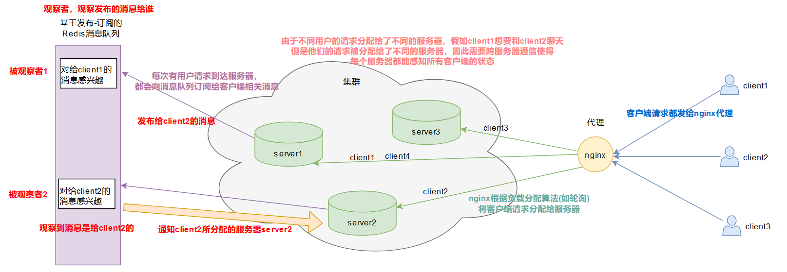
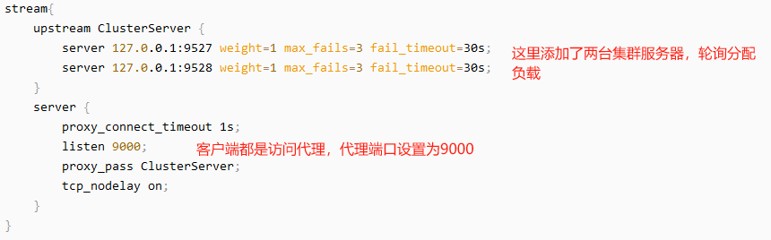
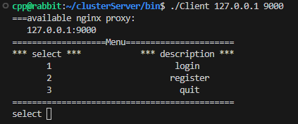

# 1、nginx配置TCP负载均衡
[https://blog.csdn.net/weixin_48494235/article/details/141924179](https://blog.csdn.net/weixin_48494235/article/details/141924179)


# 2、先利用mysql建表
```sql
create table User(
    id INT PRIMARY KEY AUTO_INCREMENT COMMENT ' 用户id',
    name VARCHAR(50) NOT NULL UNIQUE COMMENT ' 用户名',
    password VARCHAR(50) NOT NULL COMMENT '用户密码',
    state ENUM('online','offline') DEFAULT 'offline' COMMENT '当前登录状态'
);

create table Friend(
    userid int not null comment '用户id',
    friendid int not null comment '好友id',
    primary key(userid, friendid)
);

create table AllGroup(
    id int primary key auto_increment comment '组id',
    groupname varchar(50) not null comment '组名称',
    groupdesc varchar(200) default '' comment '组功能描述'
);

create table GroupUser(
    groupid int not null comment '组id',
    userid int not null comment '组员id',
    grouprole enum('creator', 'normal') default 'normal' comment  '组内角色',
    primary key(userid, groupid)
);

create table OfflineMessage(
    userid int not null comment '用户id',
    message varchar(500) not null comment '离线消息'
);
```

# 3、编译运行
```bash
cd ./bin  # 切换到bin目录下
# 端口号视nginx的配置而定
./Server 127.0.0.1 9527
./Server 127.0.0.1 9528
./Client 127.0.0.1 9000
```

 
测试：

（1）观察客户端请求会轮询分配给集群服务器；

（2）观察业务功能测试结果，看一下MySQL中表数据变化；
